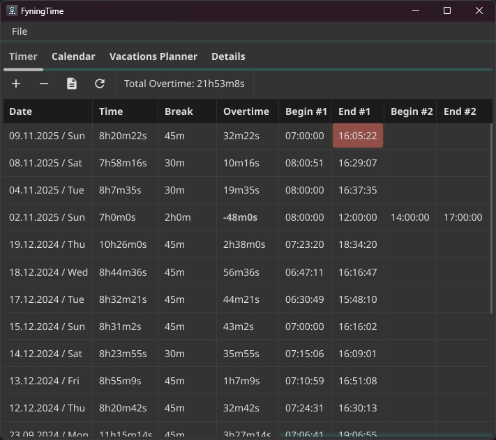

# FyningTime

FyningTime (based on the Go framework Fyne) helps to track down your work time.

## Features which are planned:

* ✅ Add/Edit/Delete time
* Auto update feature (based on Github deployed package)
* Customize your time table as you wish
* ✅ Everything is local (sqlite) no data will be exposed or tracked (sadly it's a feature)
* By wish, the app starts/ends automatically by startup/shutdown and tracks beginning of your work day. (Next day you can review it anyway 😬)
* Customize the app
* Create a notification warning if you work too long! (It would be sad if you work too long. 😉)
* Vacation planning
* ✅ Calendar view
* Import your excel where you tracked your worktime
* ✅ See how much overwork you did

For more see issues tagged as feature: https://github.com/FyningTime/FyningTime/issues?q=is%3Aopen+is%3Aissue+label%3Afeature

## Languages

To be honest, it was translated wit ChatGPT-5. If something is wrong, please create a better PR.
Neither I nor you do not trust machine translations 100%.
Thanks and I am sorry for any mistakes!

## Screenshots

**WIP!**

